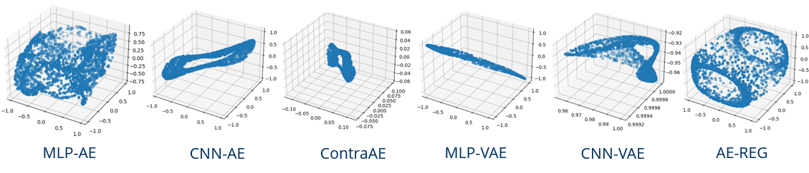

# Autoencoder regularisation 
Legendre-Latent-Space Regularisation ensures Toplogical Data-Structure Preservation under Autoencoder Compression

This repo contains code and supplementary material of the corresponding article, available here: TBA

## Datasets
* Fashion MNIST
* MRI brain scans : [Open Access Series of Imaging Studies (OASIS)](https://oasis-brains.org/#data)
* synthetic datasets of points on high-dimensional circle and torus 

## The repository consists of the following autoencoder models: 

* MLP-AE : Multilayer perceptron autoencoder
* AE-REG : Regularized autoencoder (proposed AE with Jacobian regularization)
* Hybrid AE-REG : Hybrid regularized autoencoder (Proposed AE with hybridization through orthogonal polynomial interpolation and Jacobian regularization)
* CNN-AE : Convolutional neural network autoencoder
* Contra AE : Contractive Autoencoder  
* MLP-VAE : Multilayer perceptron-based variational autoencoder
* CNN-VAE : Convolutional neural network-based variational autoencoder

## Topology retention experiments using synthetic datasets of points on high-dimensional circles and tori 

Before running any files in the repository, change the directory to root using `cd ./autoencoder-regularisation-`

* 15-dimensional circle: `python ./cycle_tori_experiments/circle_exp.py`
* 15-dimensional torus: `python ./cycle_tori_experiments/tori_exp.py`
* 1024-dimensional torus: `python ./cycle_tori_experiments/tori_dim_1024_exp.py`

The image shows different autoencoder embeddings of high dimensional tori to their intrisic three dimensional space

## Preprocessing of MRI brain scans dataset 

From [Open Access Series of Imaging Studies (OASIS)](https://oasis-brains.org/#data) dataset images in the format .dwi (Diffusion-weighted imaging) were considered with a chosen single channel from each image. These three-dimensional images were sliced into two-dimensional cross-sections to generate the MRI brain scan image dataset used in the experiments performed. 

### Orthogonal polynomial regression step for Hybrid AE-REG before training

This step before training of the proposed Hybrid AE-REG involves fitting involves extraction of the coefficients for the fitted orthogonal polynomial series

* Run `python ./coefficients_computation_for_fitted_polynomials/FashionMNIST/parallel_0_to_10_dq25.py` to perform polynomial regression over the Fashion MNIST dataset. Set `no_images` and `deg_quad` as required or keep the default values.
* Run `python ./coefficients_computation_for_fitted_polynomials/FashionMNIST/LSTSQparallel_fmnsit_train_dq20.py` to extract coefficients in parallel using multiple cores.

* Similarly run `python ./coefficients_computation_for_fitted_polynomials/MRI_scans/parallel_0_to_10.py` and other files in  `./coefficients_computation_for_fitted_polynomials/MRI_scans/` to extract fitted polynomial coefficients for MRI brain scan dataset. 

## Training all the autoencoders 

### Fashion MNIST dataset

* MLP-AE and AE-REG : `python ./train_nonHybrid_MLPAE_AEREG_FashionMNIST/mlpae_aereg_FMNIST.py`
* Hybrid AE-REG : `python ./train_Hybrid_AEs_FashionMNIST/Hybrid_AE_REG_fmnist.py`
* CNN-AE : `python ./train_CNN_AE_FMNIST_MRI/convAE_FMNIST.py`
* Contra AE : `python ./train_ContraAE_FMNIST_MRI/contraAE_FMNIST.py` 
* MLP-VAE : `python ./train_MLP_VAE_FMNIST_MRI/vae_mlp_FMNIST.py`
* CNN-VAE : `python ./train_CNN_VAE_FMNIST_MRI/vae_cnn_FMNIST.py`

### Dataset of two-dimensional slices of MRI brain scans

To pre-save the MRI dataset to later enumerate through it while training, run `python ./DataPreprocessing/MRI/getSingleTensorTreainTestDatasets.py` which saves the train and test image dataset as `/savedData/trainDataSet.pt` and `./savedData/testDataSet.pt`

* MLP-AE and AE-REG : `python ./train_nonHybrid_MLPAE_AEREG_MRI/train_full_data/MRI_train_call10.py` to train over the whole dataset or run `python ./train_nonHybrid_MLPAE_AEREG_MRI/train_var_TDA/MRI_train_call10.py` to flexibly change the training data amount(TDA) considered 
* Hybrid AE-REG : `python ./train_Hybrid_AEs_MRI/Hybrid_AEREG_MRI.py`
* CNN-AE : `python ./train_CNN_AE_FMNIST_MRI/convAE_MRI.py`
* Contra AE : `python ./train_ContraAE_FMNIST_MRI/contraAE_MRI.py` 
* MLP-VAE : `python ./train_MLP_VAE_FMNIST_MRI/vae_mlp_MRI.py`
* CNN-VAE : `python ./train_CNN_VAE_FMNIST_MRI/vae_cnn_MRI.py`